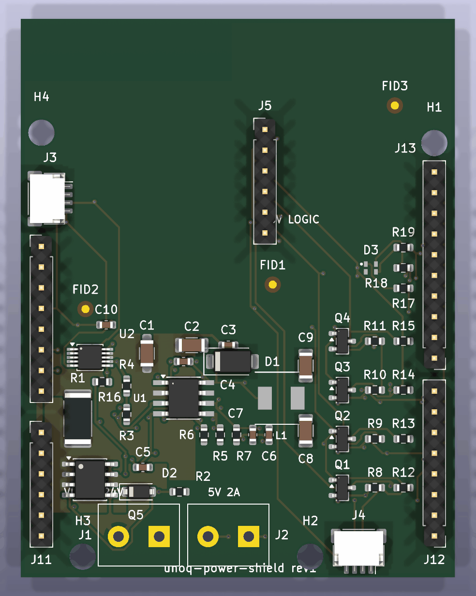
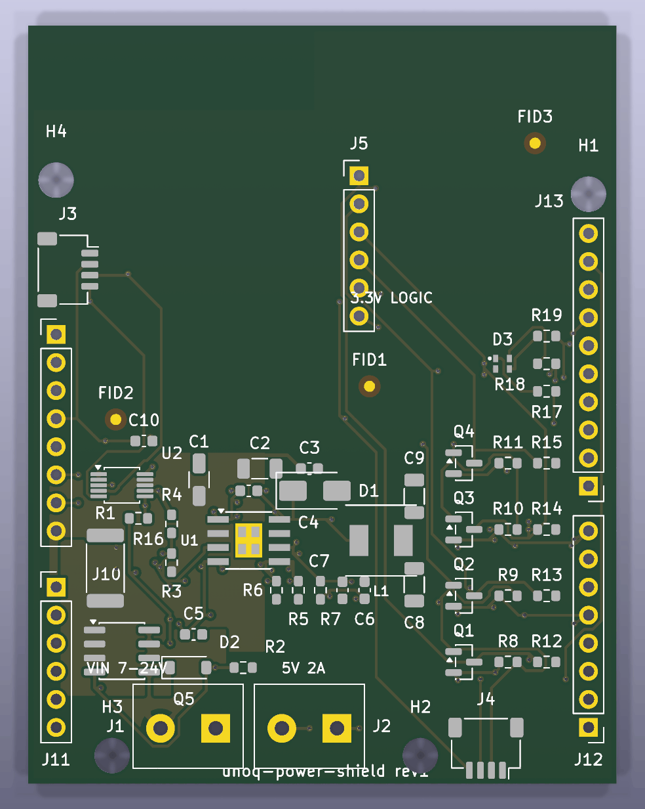

# UNO Q power & I/O demo shield

<table>
<tr>
<td width="50%"></td>
<td width="50%"></td>
</tr>
<tr>
<td align="center"><em><strong>Populated</strong> — every footprint with its 3D
model, <strong>including</strong> the stacking headers. Those ship <strong>DNP</strong>
(see below), so a board back from the assembler will not look like this until
you solder them in.</em></td>
<td align="center"><em><strong>Bare</strong> — the PCB the fab builds from the
gerbers: four-layer copper, mask, silk, and the three X2-tagged fiducials the
assembler's vision system needs.</em></td>
</tr>
</table>

**Status: UNBUILT.** No physical board of this design has been fabricated
or powered on yet. Until one has, treat this as a reference for exercising
the pipeline, not a verified design.

The *design* has passed its pre-order gates (2026-08-30): routed with
**0 unconnected** and **0 clearance violations** across 5 identical DRC
runs, `validate_gerbers` 14/0, ERC clean, every BOM line in stock. The 17
residual DRC items are all form-factor or courtyard-graze artifacts,
individually explained in the ledger in [rev-1-plan.md](rev-1-plan.md).
Passing gates is not the same as working hardware — the UNBUILT warning
above stands until a board has been powered on.

**The stacking headers ship DNP** — the assembled board cannot plug into
anything until you solder a stacking header set into the four plated hole
strips. Any classic Arduino R3 stacking kit fits: SparkFun PRT-11417 or
Adafruit #85, about **$2**. This is deliberate: assembly houses don't stock
stacking headers, and a flush-soldered normal header would make the shield
unstackable.

The example board for this repo — the design a first-time user builds
**before trusting the pipeline with their own board**. If this builds,
routes, checks, and comes back from the fab working, the pipeline works.
That is all it proves: it says nothing about whether any *other* design is
right, and it is not a product.

## What it is

A shield for the [Arduino UNO Q](https://docs.arduino.cc/hardware/uno-q)
(classic UNO outline, stacking headers):

- **Screw-terminal VIN, 7–24 V** — the UNO Q's own DC input range. Feeds
  the Q's VIN pin and a local TPS54331 buck making 5 V for shield loads,
  behind reverse-polarity protection (the terminal a first-timer wires
  backwards).
- **INA226 high-side monitor** on the VIN rail, upstream of everything, so
  the stack reports its **own total consumption** over I²C (address 0x40,
  on D20/D21; ALERT on ~D3).
- **Four bidirectional level-shift channels** (BSS138 + 10 k) between the
  headers and 5 V peripherals, on D2/D4/D7/D8. **The UNO Q's headers are
  3.3 V logic, not the classic UNO's 5 V** — wiring 5 V gear straight in is
  the most common way this board gets damaged, and this circuit is the fix.
  **Signalling limit: ~300 kHz.** The 10 k pull-ups against ~30 pF of load
  give ~0.3 µs rise times: fine for GPIO, buttons, slow UART, and 100 kHz
  I²C-style traffic; **not for SPI above ~300 kHz and not for NeoPixels**
  (WS2812 timing needs edges these channels cannot produce). That is a
  documented property of the classic BSS138 shifter, not a defect.
- **Qwiic passthrough** (2× JST-SH, daisy-chain) on the same I²C bus.
- **RGB status LED** on ~D9/~D10/~D11, active-low, for sketches to drive.

Design record: [rev-1-plan.md](rev-1-plan.md) — every requirement cited to
Arduino's own documents, every part checked against the JLCPCB library,
every number with its arithmetic shown. Rules: [board.toml](board.toml).

## What it teaches

Each `board.toml` rule exists here for a visible physical reason:

| Rule | Why it's real on this board |
| --- | --- |
| thermal vias | the buck's exposed pad is its only real heatsink |
| power trace width | VIN carries up to 4 A; IPC-2221 sets the number |
| mounting holes | all four fixed by the UNO pattern — extracted from Arduino's own drill file |
| planes | solid ground under a switching converter |
| keepout | the UNO Q's Wi-Fi antenna is directly under the board's top-left corner — copper there detunes it |
| fiducials, X2-tagged | assembly needs them, and untagged ones are invisible to gerber-level checking |

## What it costs (estimate, 2026-08)

- 4-layer PCB, 5 pcs: ~$8–15
- JLCPCB SMT assembly (2–5 boards): setup ~$25, ~10 Extended-part feeder
  fees ~$30, parts ~$2.5/board, THT screw terminals hand-solder fee
- **Ballpark: $70–90 for a small assembled batch**
- Stacking headers are DNP — fit any Arduino stacking-header kit (~$2)

## Power behavior

| Supply | Result |
| --- | --- |
| USB-C only | UNO Q runs; shield 5 V rail is off (needs VIN) — by design |
| VIN only | everything runs; the Q is powered through its VIN pin |
| both | fine — the Q diode-ORs internally; the shield never drives the 5 V or 3V3 header pins |

## Attribution

The UNO Q facts in this design — pinout, electrical limits, mechanical
coordinates, antenna location — come from Arduino's official documents and
CAD files for the UNO Q (ABX00162), © Arduino SA, licensed
[CC BY-SA 4.0](https://creativecommons.org/licenses/by-sa/4.0/):
datasheet, full pinout, schematics, and fab data, copies in
[docs/datasheets/](../../docs/datasheets/). The antenna keepout and
hole/header coordinates were extracted from the gerber and NC-drill files
Arduino publishes there. This example's own design files are MIT like the
rest of the repo; the CC BY-SA attribution above covers what was derived
from Arduino's documents.
